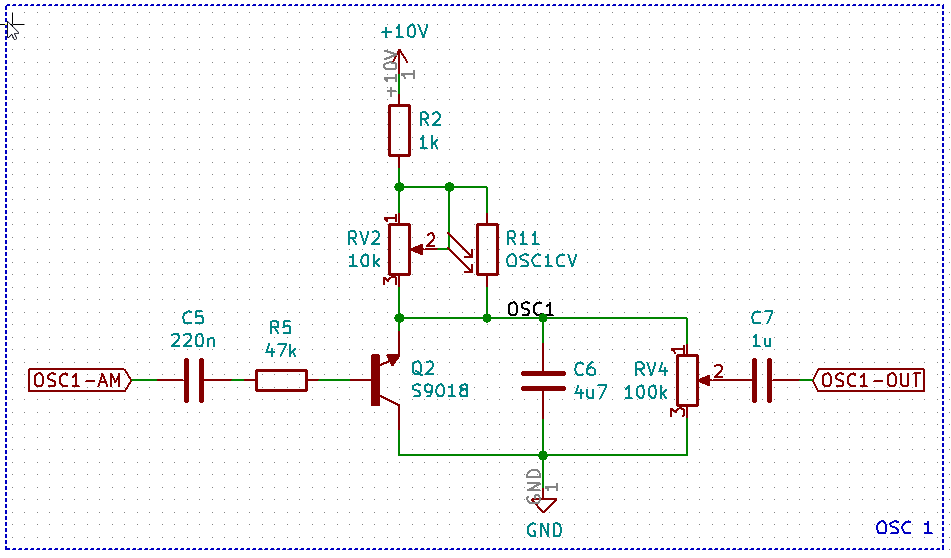
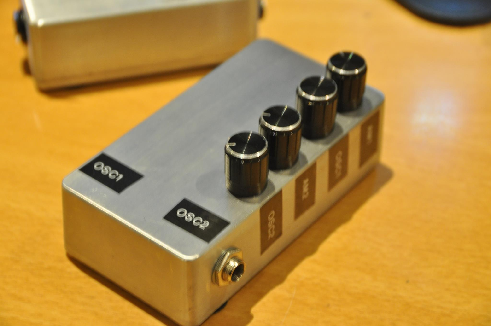
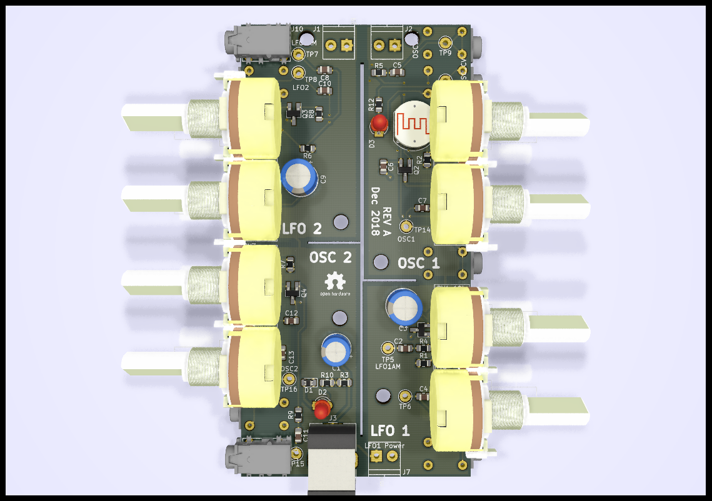
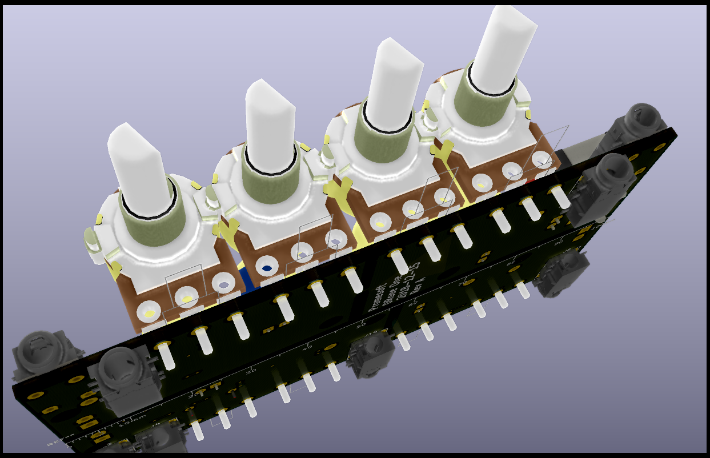

# Kicad-droneosc
This is a very simple circuit based around S9018 NPN BJT's.

It creates a saw pulse and in this config I can modulate them via the base of the BJT. Its inspired by the work of [Kerry Wong](http://www.kerrywong.com/2014/03/19/bjt-in-reverse-avalanche-mode/) and [Sam Battle](https://www.lookmumnocomputer.com/projects/#/simplest-oscillator/)

## Reverse Avalanche Breakdown
As this oscilator is based on reverse avalanche breakdown it is highly dependent on the type of BJT used. For this setup the SS9018 high frequency transistor has been selected as it start oscilating below 9V (which is often used in stomp box effect pedals). 
For more details on this oscilator visit [AN47](https://www.analog.com/media/en/technical-documentation/application-notes/an47fa.pdf)

## Status - Rev A board layout and Gerber
### Errata

### Issues and Notes

## Physical Construction
 - 50,8x100,2mm
 - Optional cut in 2 
 - Mounting in either Eurorack or Stompbox 1590B

## Vital Components
 - Jack connectors: PJ-321 (important for the footprint)
 - SS9018 HJ NPN BJT for the oscillator (important for the voltage)
 - 5516 LDR for the vactrol (matched with the pot for the osc)

## Features
4 Separate saw oscillators.
 - 2 identical
 - 1 simple
 - 1 with VCO (Vactrol) and Modulation input

## Modulation
### AM
Each section of the oscilators are AC coupled with a reasonably high input resistance that in the prototype enabled cascading of the oscilators so the output of the oscilator would be AM mulated with the input on the base.
### CV / FM / Vactrol
Prototype has been performed with a GL5516 LDR in a heat shrink package with an LED - its not exactly 1V/Oct but it works

# Prototype implementation
A simple stripboard implementation in a 1590B stompbox

# 3D 
Visualization of the board

## LFO 1 and OSC 1 3D

# LFO 1 Schematic

