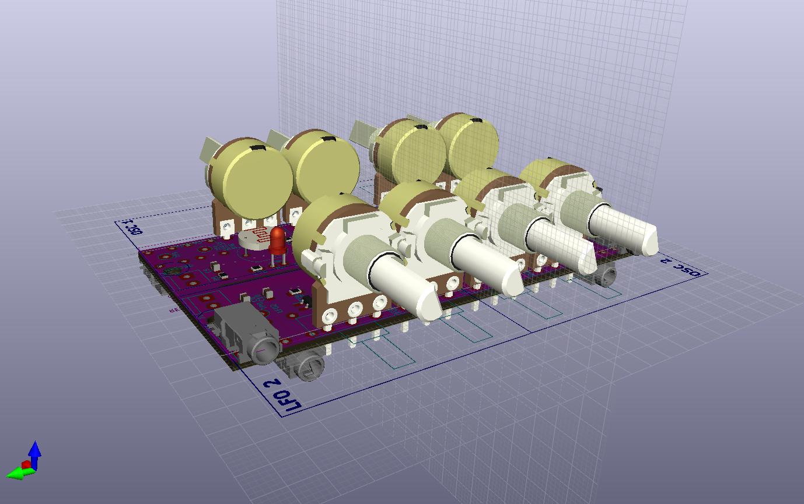

# Kicad-droneosc

This is a very simple circuit based around S9018 NPN BJT's.

It creates a saw pulse and in this config I can modulate them via the base of the BJT. Its inspired by the work of [Kerry Wong](http://www.kerrywong.com/2014/03/19/bjt-in-reverse-avalanche-mode/) and [Sam Battle](https://www.lookmumnocomputer.com/projects/#/simplest-oscillator/)

# Reverse Avalanche Breakdown
As this oscilator is based on reverse avalanche breakdown it is highly dependent on the type of BJT used. For this setup the SS9018 high frequency transistor has been selected as it start oscilating below 9V (which is often used in stomp box effect pedals). 
For more details on this oscilator visit [AN47](https://www.analog.com/media/en/technical-documentation/application-notes/an47fa.pdf)

# Prototype implementation
A simple stripboard implementation in a 1590B stompbox

# 3D 
Visualization of the board

# LFO 1 Schematic

